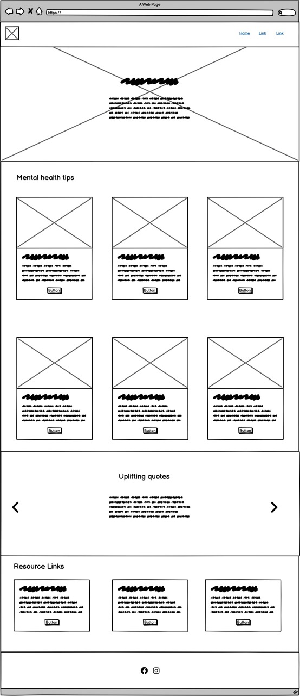
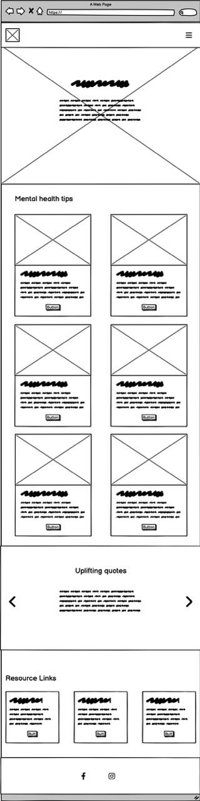
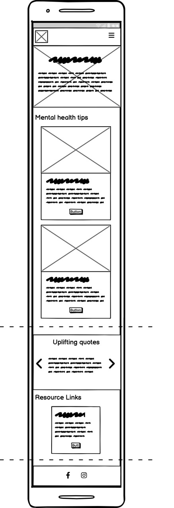
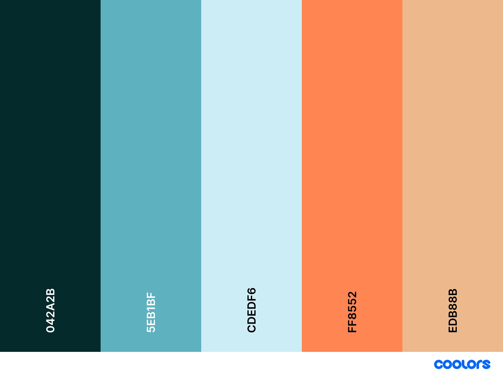
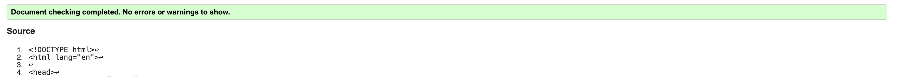
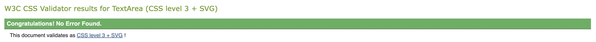
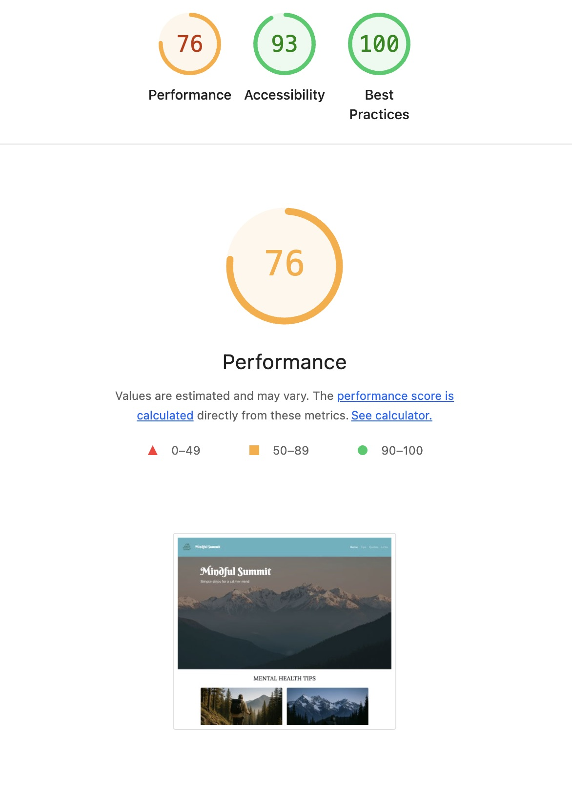

# Mindful Summit

## Overview

### Purpose

The purpose of this project, Mindful Summit, is to design a calming, accessible, and beginner‑friendly website that helps users explore practical mental health tips in a supportive environment. By combining a nature‑inspired visual theme with clear navigation and diverse, inclusive imagery, the site aims to reduce barriers to accessing mental health information. It provides simple guidance on everyday practices such as mindfulness, sleep, physical activity, and gratitude, while also connecting users to trusted external resources and support networks. Ultimately, the project seeks to create a positive user experience that empowers individuals to recognize common challenges, manage stress, and take small, meaningful steps toward wellbeing.

### Target Audiance

The target audience for Mindful Summit includes individuals who are new to exploring mental health resources and want simple, beginner‑friendly guidance. The site is designed for people of all ages and backgrounds who may feel overwhelmed by complex information and prefer clear, practical tips they can apply in daily life.

## User Stories

_Must have_ **User story 1**: As a first-time visitor I want to see a welcoming message in a calming design So that I feel safe and encouraged to explore mental health tips.

**Acceptance Criteria**

-   A hero image containing a calming nature scene.
-   Natural calming color scheme.
-   A responsive well oraganised layout that works on phone a bigger screens.

---

_Must have_ **User Story 2**:As a user feeling stressed, I want to quickly find practical stress management tips So that I can try something helpful right away.

**Acceptance Criteria**

-   A selection of cards with tips to help mental health

---

_Should have_ **User Story 3**: As someone looking for professional help, I want to access trusted external resources via clear links So that I can find support beyond this site when needed.

**Acceptance Criteria**

-   A section with external links to other helpful websites or organisations.

---

_Could have_ **User Story 4**: As some looking to be inspired, I would like to read some inspireing quotes.

**Acceptance Criteria**

-   A section with revolving quotes to ispire.

---

## Design Decisions

Wireframes

Aresponsive design using bootstrap cards to control responsivness over diferent size screens.

---

## Colors

I chose the colors to have a calming effect and match the imagry of the website.

## AI Tools

-   Co pilot used in planning to make user stories.
-   Co pilot asked for ideas of colour pallet. then adjusted by myslef.
-   Co pilot to make the logo and card images.
-   Used Co pilot to suggest how to add jumbotron to header.
-   Used Co pilot to add in the quote carousel and change BG color.
-   Asked Co pilot how to move the link in nav to right side.

## Future improvements

-   A section of personal stories.
-   A form to sign up to a newsletter.
-   More information in the footer including emergency numbers.
-   Fix when navigation bar covers headings when links are clicked.

# Testing and Validation

## Testing Results

I used Devtools resposinve feature to test how the website would look on different screen sizes. I used a mibile first aproach and adjusted for larger screens.

# Validation

Near the end of my build I used https://validator.w3.org/ to check for errors. index.html had a couple of small errors with a quick fix.

Style.css returned no errors

Lighthouse testing shows only loading speed performance issues

